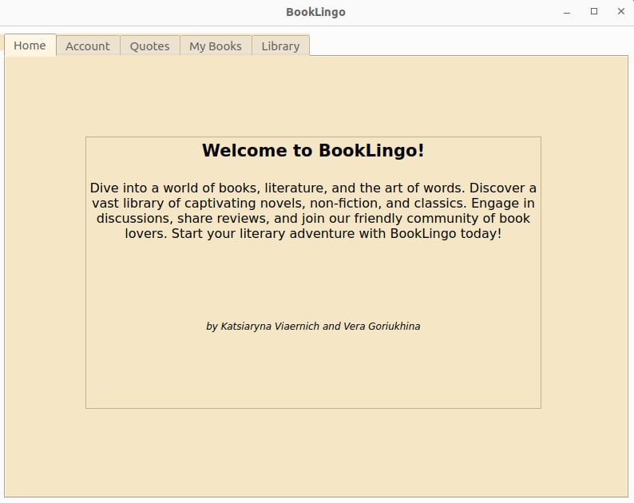
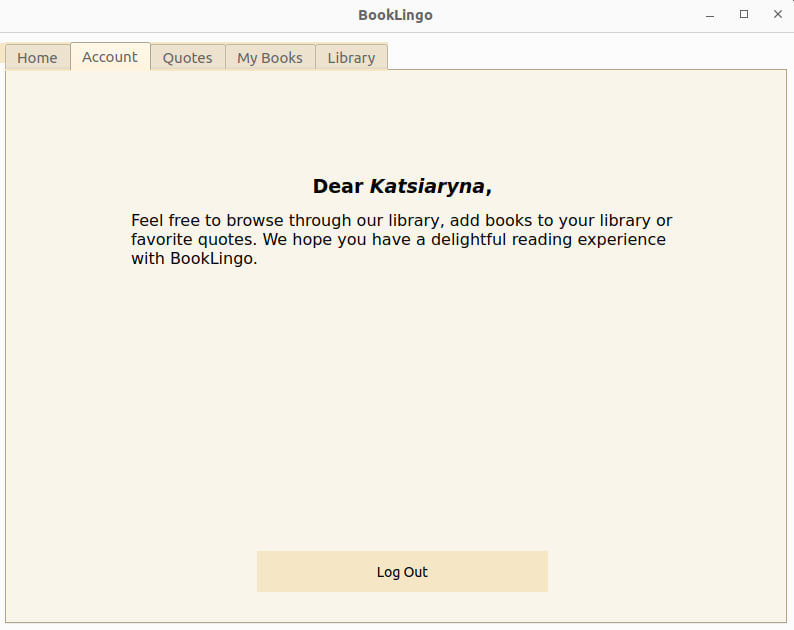
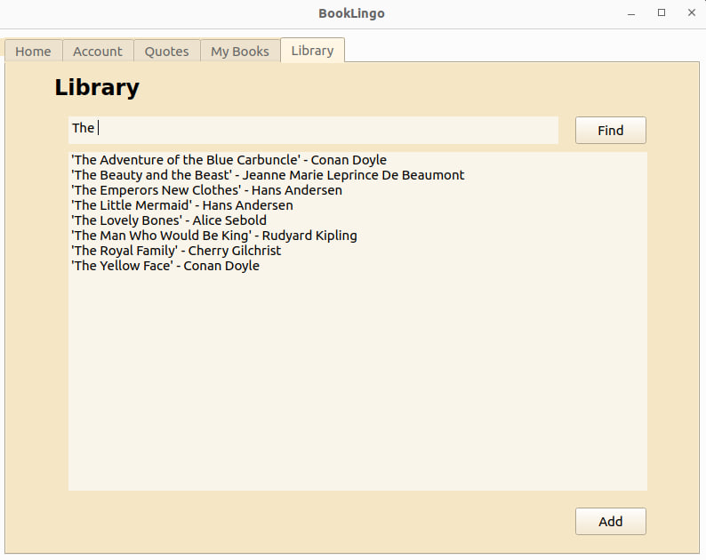
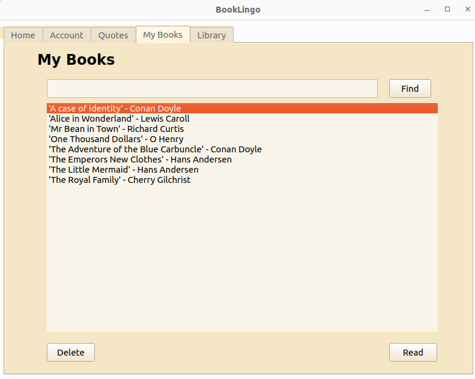
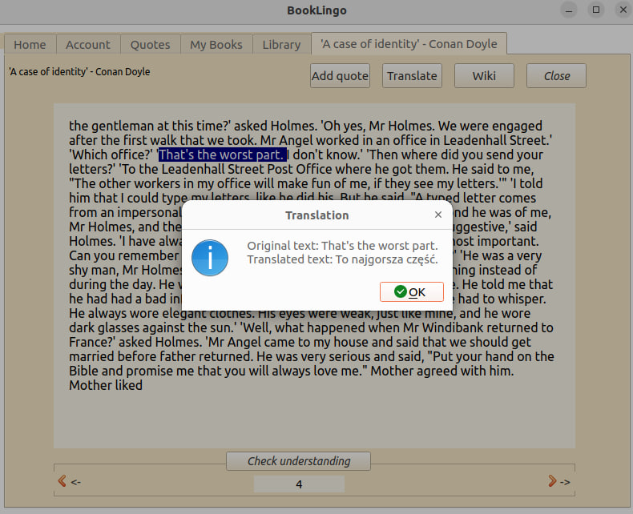
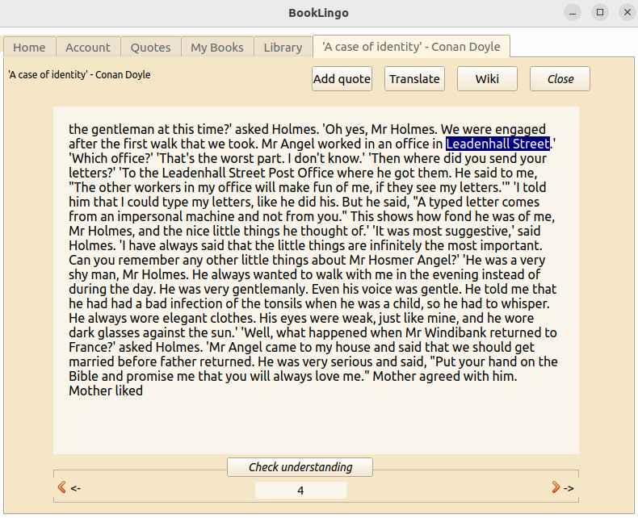
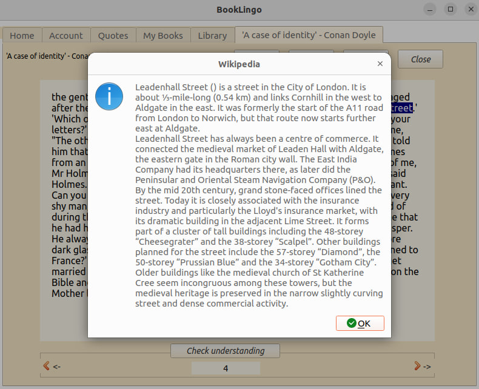
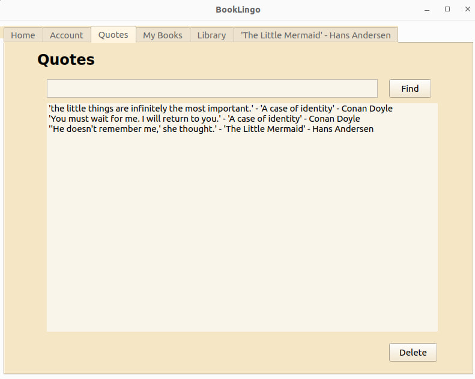
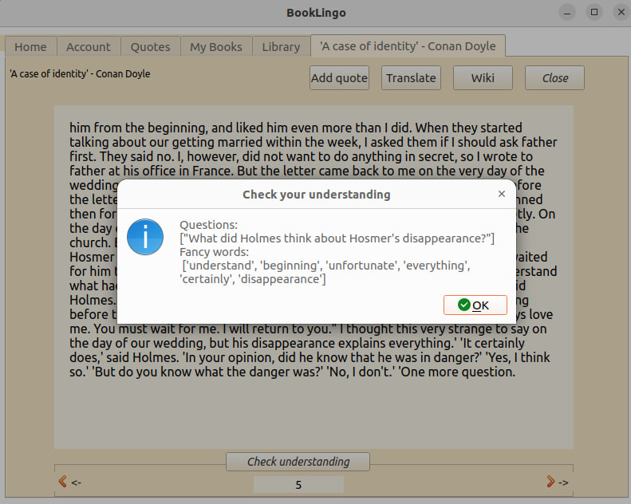

# BookLingo *by Katsiaryna Viarenich and Vera Goriukhina*
-----
Welcome to our book project, an app designed to enhance your reading experience and to help in learning English. With our app, you can:

### Store Your Favorite Books
Easily organize and access your beloved books, making it convenient to revisit your reading list.

### Save Quotes
Capture and preserve your favorite book quotes. Keep a digital repository of literary inspiration at your fingertips.

### Language Translation
Effortlessly translate words, phrases, or entire sentences into Polish language. 

### Wikipedia Integration
Get instant access to Wikipedia definitions. Deepen your understanding of the content you're reading by seamlessly integrating Wikipedia knowledge.

### Self-Test Your Comprehension
Check your understanding of a page with our built-in question generator!

-----

## Getting Started

To run our app without Docker for the first time, you need to follow these steps:

1. **Python 3.10**: Ensure you have Python version 3.10 installed on your system.

2. **Install Required Packages**: Install the necessary Python packages by running the following command:
```
pip install -r requirements.txt
```
3. **Setup the Application**: Execute the setup script to prepare the local database for use:
```
python scripts/run_setup.py
```
4. **Load Data**: Load initial books into the application by running:
```
python scripts/run_load_data.py
```
5. **Run the App**: Start the app with the following command:
```
python scripts/run_app.py
```
-----
## Screenshots
### Welcome page


### Logging in


### Library


### Your books 


### Translation


### Wikipedia integration



### Quotes


### Check understanding



Thank you for using BookLingo. Happy reading!

